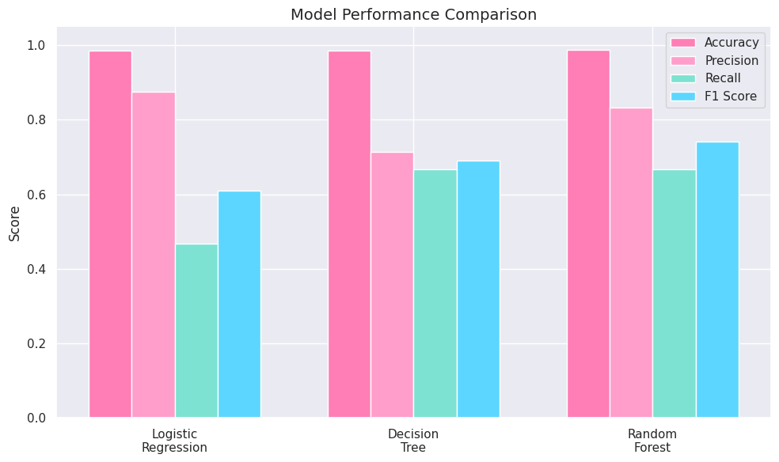
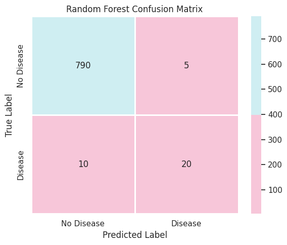

# Thyroid Disease ML Classification

Machine learning project focused on predicting hyperthyroid disease using clinical patient data from the UCI Thyroid Disease Dataset.

## Overview

Thyroid disease is one of the most common endocrine disorders and can significantly impact a patient's health and quality of life. This project explores the use of supervised machine learning techniques to classify hyperthyroid disease based on patient medical attributes.

The project follows a complete machine learning workflow, including:

* Data preprocessing and cleaning
* Missing value handling
* Categorical feature encoding
* Exploratory data analysis
* Model training and evaluation
* Performance comparison across multiple algorithms

Three classification models were implemented and evaluated:

* Logistic Regression
* Decision Tree
* Random Forest

The objective was to determine which model provided the strongest predictive performance for thyroid disease detection.

## Dataset

Source: UCI Machine Learning Repository – Thyroid Disease Dataset

The dataset contains patient demographic information, laboratory test results, and diagnostic indicators related to thyroid disorders. Both numerical and categorical features were included, requiring preprocessing before model training.

## Technologies Used

* Python
* Pandas
* NumPy
* Scikit-Learn
* Matplotlib
* Google Colab

## Results

The models were evaluated using Accuracy, Precision, Recall, and F1 Score.

| Model               | Accuracy   | Precision | Recall    | F1 Score  |
| ------------------- | ---------- | --------- | --------- | --------- |
| Logistic Regression | 98.39%     | 87.5%     | 46.7%     | 60.9%     |
| Decision Tree       | 98.39%     | 71.4%     | 66.7%     | 69.0%     |
| Random Forest       | **98.75%** | **83.3%** | **66.7%** | **74.1%** |

The Random Forest classifier achieved the strongest overall performance, producing the highest accuracy and F1 Score while maintaining strong precision and recall.

## Visualizations

### Model Performance Comparison

### Random Forest Confusion Matrix

## Full Project Report

A detailed report describing the methodology, preprocessing pipeline, model evaluation, results, and conclusions can be found here:

[📄 Machine Learning Approaches for Thyroid Disease Detection](reports/Machine-Learning-Approaches-for-Thyroid-Disease-Detection.pdf)

